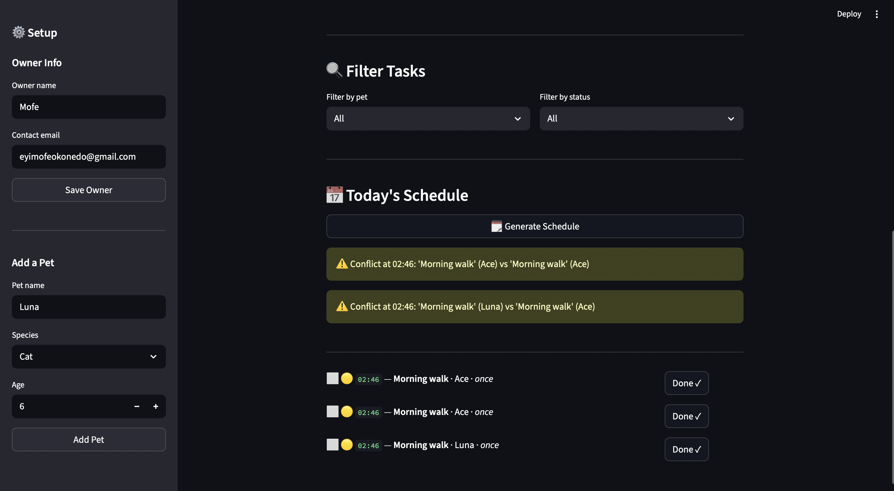
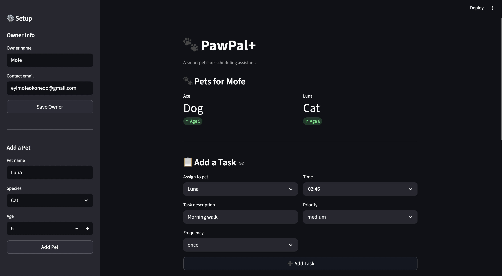

# PawPal+ (Module 2 Project)

You are building **PawPal+**, a Streamlit app that helps a pet owner plan care tasks for their pet.

## Scenario

A busy pet owner needs help staying consistent with pet care. They want an assistant that can:

- Track pet care tasks (walks, feeding, meds, enrichment, grooming, etc.)
- Consider constraints (time available, priority, owner preferences)
- Produce a daily plan and explain why it chose that plan

Your job is to design the system first (UML), then implement the logic in Python, then connect it to the Streamlit UI.

## What you will build

Your final app should:

- Let a user enter basic owner + pet info
- Let a user add/edit tasks (duration + priority at minimum)
- Generate a daily schedule/plan based on constraints and priorities
- Display the plan clearly (and ideally explain the reasoning)
- Include tests for the most important scheduling behaviors

## Getting started

### Setup

```bash
python -m venv .venv
source .venv/bin/activate  # Windows: .venv\Scripts\activate
pip install -r requirements.txt
```

### Suggested workflow

1. Read the scenario carefully and identify requirements and edge cases.
2. Draft a UML diagram (classes, attributes, methods, relationships).
3. Convert UML into Python class stubs (no logic yet).
4. Implement scheduling logic in small increments.
5. Add tests to verify key behaviors.
6. Connect your logic to the Streamlit UI in `app.py`.
7. Refine UML so it matches what you actually built.


# 🐾 PawPal+

A smart pet care scheduling assistant built with Python and Streamlit.

## 📸 Demo

<!-- Replace the filename below with your actual screenshot -->



---

## 🚀 Getting Started

```bash
python -m venv .venv
source .venv/bin/activate  # Windows: .venv\Scripts\activate
pip install -r requirements.txt
streamlit run app.py
```

---

## ✨ Features

- **Owner & pet management** — create an owner and add multiple pets
- **Task scheduling** — assign tasks with time, priority, and frequency
- **Sorting by time** — tasks are always displayed in chronological order using a lambda sort on HH:MM strings
- **Filtering** — filter the schedule by pet name or completion status
- **Conflict warnings** — the Scheduler detects when two tasks share the same time slot and displays a warning in the UI
- **Recurring tasks** — daily and weekly tasks automatically reschedule themselves when marked complete using Python's `timedelta`
- **Priority indicators** — 🔴 High / 🟡 Medium / 🟢 Low color coding on every task

---

## 🧠 Smarter Scheduling

The `Scheduler` class acts as the brain of PawPal+. It never stores data itself — it reads tasks through the `Owner → Pet → Task` chain. Key algorithms:

- **`sort_by_time()`** — uses `sorted()` with a lambda key on the `HH:MM` time string
- **`filter_tasks()`** — chains pet name and completion status filters
- **`detect_conflicts()`** — uses a dictionary to track seen time slots; returns warning strings instead of raising exceptions
- **`handle_recurring()`** — marks a task complete and returns a new `Task` with `due_date + timedelta`

---

## 🧪 Testing PawPal+

```bash
python -m pytest
```

Tests cover:
- Task completion status change
- Task addition increases pet task count
- Sorting correctness (chronological order)
- Daily and weekly recurrence scheduling
- Conflict detection for duplicate time slots
- Filtering by pet name and completion status

**Confidence level: ⭐⭐⭐⭐⭐** — all 11 tests pass.

---

## 🗂️ Project Structure

```
pawpal_system.py   # Backend logic — Owner, Pet, Task, Scheduler classes
app.py             # Streamlit UI
main.py            # CLI demo script
tests/
  test_pawpal.py   # Automated test suite
reflection.md      # Design decisions and AI collaboration reflection
```

